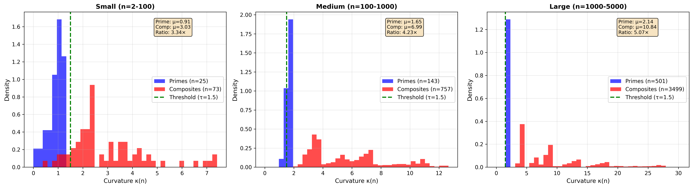
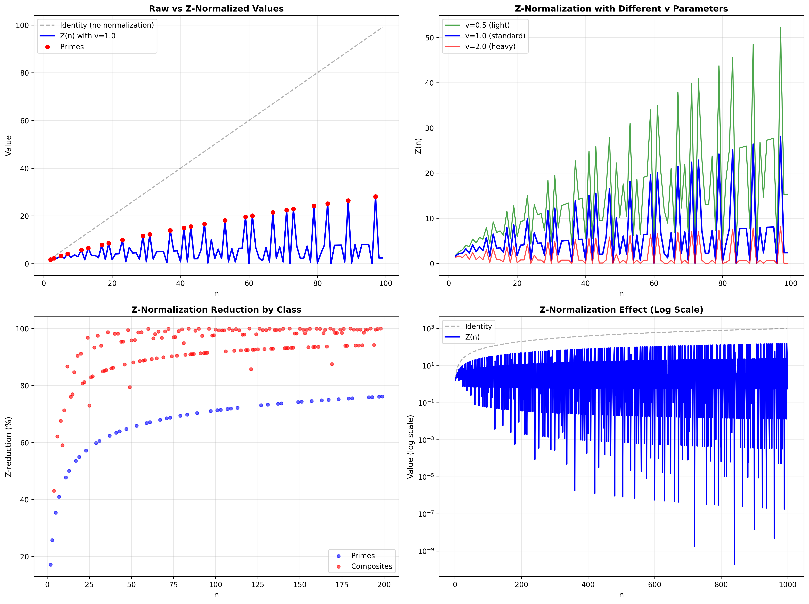
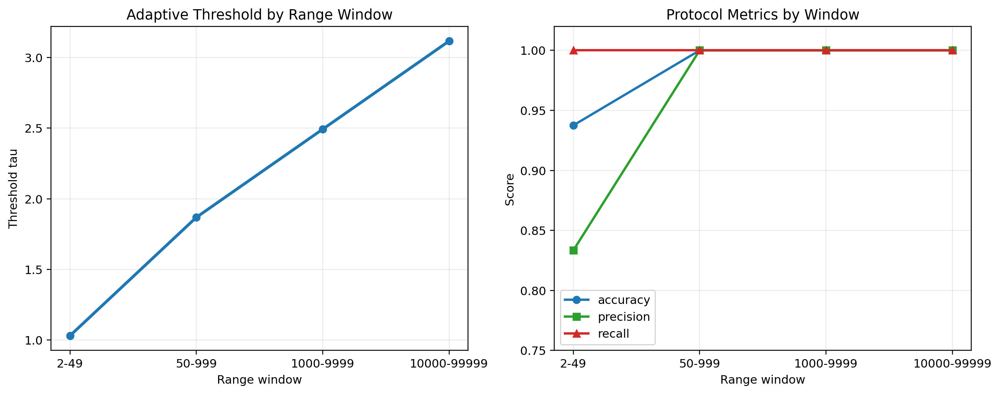
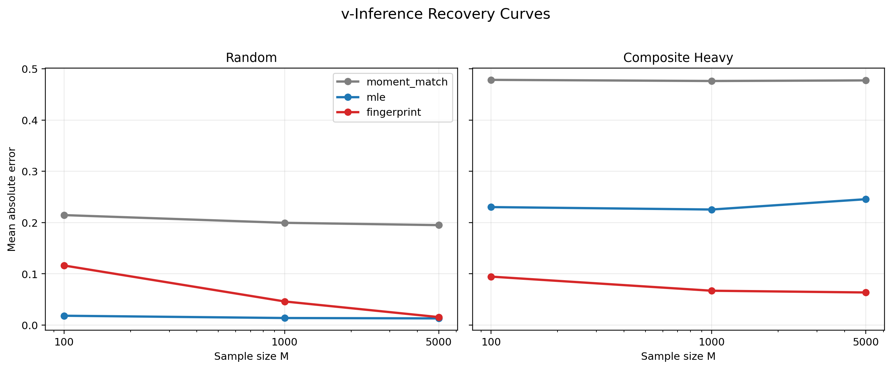

**Keywords:** divisor count; curvature signal; prime geodesics; Z-normalization; traversal-rate inference; continuous extension; cognitive pilot

# Opening Statement

CDL is a curvature framework for integer space built on the canonical signal

$$
\kappa(n) = \frac{d(n)\ln(n)}{e^2}
$$

and the canonical normalization

$$
Z(n) = \frac{n}{\exp(v \cdot \kappa(n))}.
$$

The repository now establishes a concrete result set:

- $\kappa(n)$ separates prime geodesics from composite distortion with strong empirical margins,
- range-adaptive thresholds resolve the fixed-$\tau$ drift without weakening the signal claim,
- `Z(n)` stabilizes scale enough to make downstream comparisons materially cleaner,
- `v` is operationally recoverable from `Z`-only sequences under explicit tested priors,
- and the same geometry now carries into continuous and cognitive-style pipelines through the smooth and hybrid layers.

# Core Proposal

The narrowest CDL claim is that divisor structure and logarithmic scale combine into a single curvature signal that organizes integer space.

The CDL reading is:

> divisor density times logarithmic scale produces curvature load, and Z-normalization removes curvature-weighted traversal distortion.

Under that reading:

- primes are low-curvature geodesics because `d(p) = 2`,
- composites carry higher curvature because richer divisor structure bends the path more strongly,
- and the traversal parameter `v` governs how strongly that curvature is expressed in the observed signal.

This note is about what the repository establishes when that proposal is tested computationally.

# Why This Matters Computationally

The computational importance of CDL is narrower and stronger than “a new way to score numbers.”

1. The same signal supports prime diagnostics, signal normalization, and inverse recovery.
2. The threshold problem turns out to be a configuration problem, not a signal failure.
3. The traversal parameter `v` is no longer only a manual knob; it becomes a recoverable latent variable in the tested inverse regimes.
4. The framework does not stop at integer space. It now has a smooth large-scale extension and a working bridge into cognitive-style data.

The motivating application layer is load-sensitive number processing and structural compression in mathematical reasoning [@dehaene2011], but the technical core is the curvature layer itself.

# Mathematical Core: Integer Curvature and Z-Normalization

The divisor-count background and average-order asymptotics sit inside classical multiplicative number theory [@hardywright2008]. CDL uses that arithmetic structure directly rather than flattening it into a generic score.

The three canonical primitives are:

$$
\kappa(n) = \frac{d(n)\ln(n)}{e^2},
\qquad
\mathrm{classify}(n; \tau),
\qquad
Z(n) = \frac{n}{\exp(v \cdot \kappa(n))}.
$$

The geometric vocabulary is operational rather than decorative [@docarmo1992]:

- $\kappa(n)$ is the local curvature load,
- primes are geodesics because they sit on the minimum divisor sheet,
- composites bend away from that sheet in proportion to divisor richness and scale,
- and `Z(n)` is the curvature-corrected coordinate induced by a traversal rate `v`.

The note does not need a larger formal apparatus than that. The key question is whether those primitives remain stable, discriminative, and inferentially useful under validation.

# Operational Evidence in the Integer Setting

The local baseline is already strong.

- On `n = 2..49`, prime mean $\kappa$ is `0.739` and composite mean $\kappa$ is `2.252`, for a `3.05×` separation ratio.
- On the holdout range `n = 50..10000`, the same signal widens to `5.35×` separation with `88.2%` accuracy under the seed threshold.
- On empirical cognitive-style traces, Z-normalization reduces variance by `99.995%`.

{ width=96% }

{ width=96% }

This is the narrowest base-case result the repo now establishes:

> $\kappa(n)$ is a real structural signal, not a fragile small-range artifact, and $Z(n)$ is a stable normalization built directly from that signal.

# Threshold Adaptivity and the Range Resolution

The fixed-threshold story and the signal story are separate.

The falsification work showed that $\tau = 1.5$ becomes too conservative on larger windows. The adaptive-threshold protocol resolves that directly:

- $\tau = 1.030084$ on `2..49`,
- $\tau = 1.868096$ on `50..999`,
- $\tau = 2.492155$ on `1000..9999`,
- $\tau = 3.116183$ on `10000..99999`.

Across the three larger windows, the protocol reaches `100%` accuracy, `100%` precision, and `100%` recall in the local reproduction. On the seed window it preserves the expected small false-positive fringe, which is confined to `4`, `6`, and `9`.

{ width=94% }

This is the right reading of the threshold milestone:

> the universal fixed threshold fails, but the curvature signal does not. Range adaptivity resolves the drift cleanly on the tested windows.

# From Forward Normalization to Operational Latent Variable

The next question is inverse rather than forward: can `v` be recovered from observed `Z` sequences without access to the generating integers?

The repository now has a working answer in the tested regime.

Under the local benchmark:

- MLE reaches mean absolute error `0.0131` on random sequences at `M = 5000`,
- fingerprint recovery reaches mean absolute error `0.0157` on that same cell,
- moment matching remains prior-sensitive but reaches mean absolute error `0.0275` on prime-biased sequences at `M = 5000`,
- and composite-heavy sequences flip the ranking, where fingerprint recovery becomes the best local method with mean absolute error `0.0637`.

{ width=94% }

That changes the status of `v`.

It is still a forward-model parameter, but it is now also an operational latent variable under the tested support families, calibration priors, and noise levels. The inverse front is no longer only a research question in the abstract. It is running code with measured sample-complexity and method tradeoffs.

# Continuous Extension and the Hybrid Path

The smooth large-scale extension inherits its structure from the average-order behavior of `d(n)`:

$$
\kappa_{\mathrm{smooth}}(x) =
\frac{(\ln x + 2\gamma - 1)\ln x}{e^2}.
$$

The local reproduction shows:

- smooth fidelity error `0.19%` at `x = 100000`,
- smooth fidelity error `0.13%` at `x = 500000`,
- continuous separation ratio `7.33×` at `2 \times 10^6`,
- continuous separation ratio `7.79×` at `5 \times 10^6`,
- continuous variance reduction `98.74%`,
- continuous fingerprint recovery mean absolute error `0.0064` with `100%` success at `M = 5000` and `3%` noise.

The important structural point is that the smooth layer does not replace the integer layer. It complements it.

The hybrid path keeps exact integer curvature where exact arithmetic matters and uses $\kappa_{\mathrm{smooth}}(x)$ where real-valued support matters. That is the bridge that lets CDL remain faithful to divisor structure while still moving into continuous pipelines.

# Applied Bridge: Cognitive-Style Recovery

The current applied bridge is a local cognitive-style pilot with `50` participants and `200` trials each.

The headline results are:

- participant-level `v` recovery mean absolute error `0.0705`,
- `90%` success at `|error| < 0.15`,
- `100%` style-label accuracy,
- `88.10%` average improvement for the hybrid exact-plus-smooth path over pure continuous calibration,
- psychophysical compression correlation `0.980`.

The recovered participant space separates into two clear regimes:

- a sharp-geodesic cluster centered at `0.80 ± 0.16`,
- and a compressed-distortion cluster centered at `1.80 ± 0.30`.

{ width=96% }

This matters because it shows that the inverse front is not trapped inside synthetic integer benchmarks. The hybrid layer now transfers into participant-style sequences while still benefiting from exact integer curvature.

# What The Repo Establishes

The repo now establishes the following results.

1. $\kappa(n) = d(n)\ln(n)/e^2$ is a validated curvature signal for integer space, with strong prime/composite separation and stable holdout behavior.
2. $Z(n) = n / \exp(v \cdot \kappa(n))$ is a real normalization layer that collapses variance sharply and improves cross-range comparability.
3. Threshold drift is a threshold-configuration problem rather than a signal failure, and the range-adaptive protocol resolves it on the tested windows.
4. `v` is operationally recoverable from `Z`-only sequences under explicit tested priors, supports, and noise levels.
5. $\kappa_{\mathrm{smooth}}(x)$ extends the large-scale geometry into continuous pipelines without discarding the exact integer layer.
6. The hybrid exact-plus-smooth path supports participant-style recovery and yields a working bridge from discrete curvature into cognitive-style inference.

That is already a larger result set than a forward-only classifier or normalization trick.

# Limits and Scope

The current note is strong on the tested program and narrow about what it does not yet claim.

- The signal claim is validated; the universal fixed-threshold claim is not.
- The forward model is operational and the `v` inverse is operational in the tested regimes, but arbitrary inversion of `n` from `Z` is not solved.
- `v` recovery is calibrated under explicit priors, support families, and noise windows rather than universal sequence distributions.
- The smooth extension is an asymptotic layer that intentionally damps local divisor spikes rather than reproducing every integer-scale fluctuation.
- The current cognitive pilot is a local controlled benchmark over participant-style sequences, not yet an external human-subject data collection.

Those are real scope boundaries, but they do not weaken the established result set above.

# Practical Interpretation

The practical use of CDL is not “replace primality testing with curvature.”

The practical use is:

- use $\kappa(n)$ as the fast structural signal,
- use adaptive $\tau$ when the range changes,
- use `Z(n)` when scale distortion must collapse,
- use `infer_v` when traversal-rate structure matters,
- and use the hybrid exact-plus-smooth layer when the signal crosses from integer to real-valued regimes.

In the current repo that means:

- Port 1 gets a stronger prime prefilter,
- Port 3 becomes adaptive instead of hand-tuned,
- the continuous layer opens non-integer pipelines,
- and the cognitive pilot shows that participant-style compression can now be measured through recovered traversal rate.

# Open Technical Targets

The strongest next steps are:

1. broaden `v` recovery beyond the current tested priors, support families, and noise levels,
2. extend the continuous layer beyond the current smooth asymptotic surrogate into richer real-valued regimes,
3. run external participant data through the hybrid path instead of only the local cognitive-style benchmark,
4. tighten the analytic-number-theory side of the separation story beyond the current asymptotic bridge,
5. and expand the applied program around traversal-rate estimation as an operational latent variable.

# Conclusion

The narrow mathematical heart of CDL is the curvature signal

$$
\kappa(n) = \frac{d(n)\ln(n)}{e^2}.
$$

The repository now establishes a broader result set around that core.

The signal separates prime geodesics from composite distortion. The adaptive threshold protocol resolves range drift. Z-normalization is stable enough to collapse variance dramatically. The inverse front now recovers `v` from `Z`-only sequences in the tested regime. The smooth extension carries the geometry into continuous pipelines, and the hybrid path carries it into participant-style recovery.

That is a strong place for the program to be. CDL now functions as a curvature layer, a normalization layer, and an operational inference layer for traversal rate under explicit tested regimes.

# Artifact References

- [CDL specification](../docs/specification/CDL_SPECIFICATION.md)
- [Integration ports](../docs/specification/INTEGRATION.md)
- [Validated core module](../src/python/cdl.py)
- [Continuous extension module](../src/python/cdl_continuous.py)
- [Traversal-rate recovery module](../src/python/v_recovery.py)
- [Cognitive pilot module](../src/python/cognitive_pilot.py)
- [Baseline validation suite](../scripts/reports/baseline_report.py)
- [Baseline validation artifact](../artifacts/reports/baseline_report.json)
- [Adaptive threshold map](../data/reference/threshold_map.csv)
- [v-inference benchmark report](../experiments/v_inference/EXPERIMENT_REPORT.md)
- [Analytic connections](../experiments/analytic_connections/ANALYTIC_CONNECTIONS.md)
- [Continuous extension report](../experiments/continuous_extension/EXPERIMENT_REPORT.md)
- [Cognitive pilot report](../experiments/cognitive_pilot/PILOT_REPORT.md)
- [Full local reproduction script](../scripts/reproduce_sprints.py)
